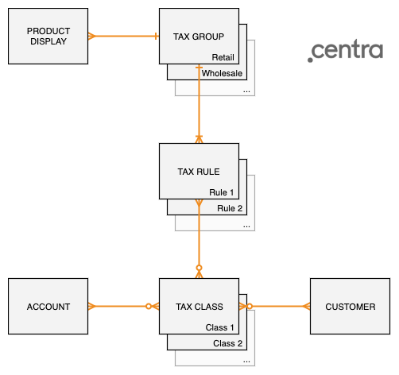

Random change in article to trigger the bug

There are three main concepts that govern how the Tax is applied in Centra: Tax Groups, Tax Rules and Tax Classes.

### Tax Groups

Tax Group consists of one or more Tax Rules, which control what amount of tax should be applied. You can configure any number of Tax Groups in Centra, but each Store can have only one default Tax Group. This will be the default Tax Group that is selected in Product Attributes configured for this store, but you can select any other Tax Group on a per-product basis, if necessary.

### Tax Rules

Random change in article to trigger the bug

Random change in article to trigger the bug

Random change in article to trigger the bug

Tax Rules control what amount of tax should be applied based on Country and Customer (B2C) or Account (B2B) Tax Classes. For example, if you're selling in EU, Australia and Japan and need to calculate VAT tax for those markets, you would create three Tax Rules: EU (with 25% tax), Australia (with 10% tax), and Japan (with 8% tax).

For each Tax Rule you can also configure if the prices in your Store should be displayed with or without tax and whether or not to apply tax to the handling and shipping fees (which is enabled by default). Finally, for countries in which tax amount depends on the state (like US, Canada or Australia), you can select to apply tax per ship-to country **and** state, in which case you will need to create separate Rules for each of the tax rates and apply them to appropriate states. It's even possible to configure tax rules applying per specific zip codes, which is sometimes used for US taxes.

[notice-box=warning]
If you enable a Tax Rule for specific US zip codes, Centra will enable zip code validation for US orders. This means only allowed zip code formats for United States will be: `NNNNN`, `NNNN-NNNNN` or `NNNNNNNNN`. Other formats will return a checkout error and prevent you from finalizing the order. You need to be aware of it and handle this scenario in your front end.
[/notice-box]

### Tax Class

Tax Classes are assigned to the Customers (B2C) and Accounts (B2B) for which the same Tax Rules should be applied. One of the popular use case is to have a "Tax exempt" class for customers who are not paying VAT or Sales tax. This means that for each country in which you have VAT-exempt customers, you will need to have two Tax Rules - one with "Tax exempt" Tax Class selected and 0% tax rate, and one for other classes with appropriate tax rate.

### How are the order taxes calculated?

When an order is created, for each order line (each item in the order) the following steps apply:
1. Check Tax Group configured for this Product, or if not selected, fetch default Tax Group for this Store,
1. Within this Tax Group, find the appropriate Tax Rule to apply by:
  1. Firstly, comparing the countries selected in the Tax Rule to the order shipping country, and
  1. Secondly, comparing the Tax Classes selected in the Tax Rule to the Tax Classes of the Customer / Account making the order.
1. Selected Tax Rule is applied to the order line and the process repeats for the next item in the order.

***

To learn more about configuring Taxes in Centra, see articles about [Tax Groups](https://support.centra.com/centra-sections/settings/tax-groups) and [Tax Classes](https://support.centra.com/centra-sections/settings/tax-classes) on our Suppoprt site.
