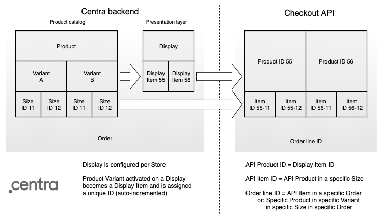
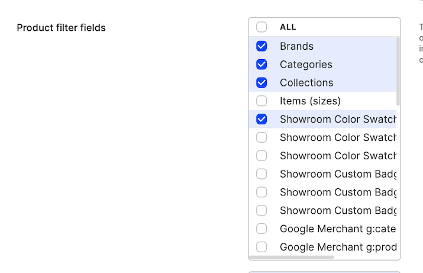
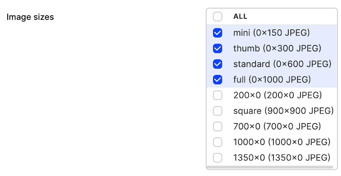
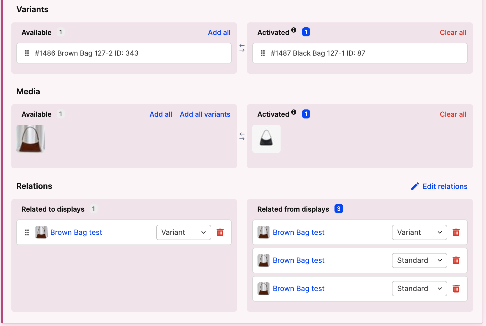
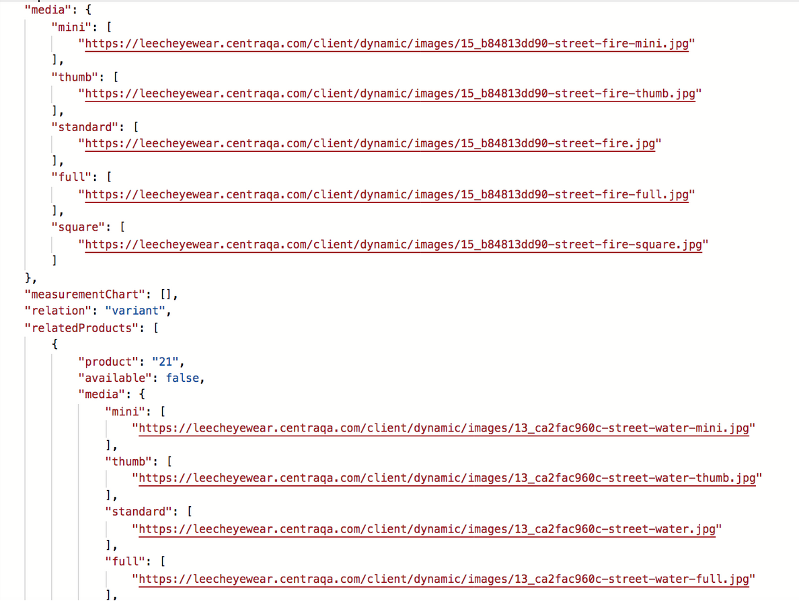
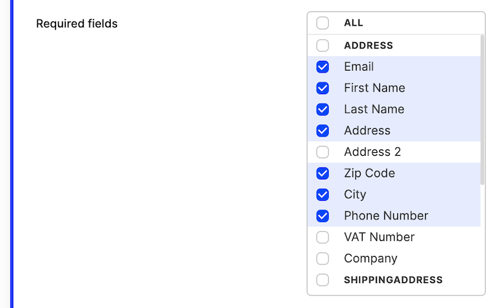

## Checkout API introduction

[Checkout API](/api-references/checkout-api) is a hybrid webshop API, built to operate both from client and server side. In client-side communication it exposes all endpoints necessary to fetch products, filter categories, build a [selection](/overview/glossary#selection) (a.k.a. cart) and complete checkout process with a number of supported payment and shipping methods. In server-side (authenticated) calls it allows you to fetch details about all Markets, Pricelists and Warehouses, or explicitly set Market, Pricelist, Country or Language for current selection.

[notice-box=alert]
Server side API calls made from a web browser will be blocked. Be careful to never expose your shared API secret.
[/notice-box]
[notice-box=info]
You can further increase your store security by filtering allowed origins in the Checkout API plugin settings. This is highly recommended in Production environment, once you're done with testing and go live.
[/notice-box]

To read about and test the most commonly used endpoints, visit our [Swagger for Checkout API](https://docs.centra.com/swagger-ui/?api=CheckoutAPI). It also contains details of all data models used in Centra.

[notice-box=readMore]
Most of the concepts below are described in [Centra overview](/overview) chapters. It's worth reading before you dive into specifics of Checkout API implementation.
[/notice-box]

### How does it work?

When using Checkout API, the end-user's session context is controlled by three main aspects:
* **Market**, which allows you to segment your store and control which products will be shown or hidden. Each Market connects to a specific Warehouse group and serves stock from Warehouses in that group.
* **Pricelist**, which controls the which product prices in which currency will be displayed to the end user. The products with no price will be returned, but are not purchasable, meaning it's impossible to add them to the selection.
* **Language**, which affects whether or not product details and categories would be translated, with a fallback to default if no translation exists for a given language.

In standard operation those three variables are set based on the end-customer's country, which can either be set based on GeoIP location, or explicitly chosen with a country selector in your webshop. Once the country is changed, following things will change as well:
* If there is a Pricelist specific for this country, change to it and update the prices in current selection.
* If there is a Market specific for this country, change to it and update the products in current selection, removing the unavailable ones.
* If there is a Language specific for this country, and content (descriptions, category names, etc.) translations for this language are available, return translated content. Otherwise, fallback to the default language.

## Elements of the webshop

Here is how you can achieve a pleasant shopping and checkout experience for your customers.

### Selection vs session token

[Selection](/overview/glossary#selection) in Centra is what other e-commerce solutions call a "basket" or "cart". When using the older [Shop API](/api-references/shop-api) the selection ID (a hash like `abeb59928306768d255e21920f9087a4`) would be exposed and used directly to add products, activate promotions and proceed through the payment process. In Checkout API we introduced a new layer of abstraction, by not exposing selection IDs directly in the API, but instead connecting them internally with session tokens (e.g. `esf1p3tgchfg5ggtpqdpgqjtt6`).

These tokens should be saved by the front end for every client session and used to keep or restore customer's previous selection. They should be sent as `API-token` header in your API calls. You can apply your own logic to them in your front end, like introducing session timeouts which should result in creating a new, empty session by sending an API call without any token and saving the newly returned one as current. One of the positive sides of this solution is that it mitigates the "old basket" problem, in which a store customer could attempt to check out an old selection, with items which are now out of stock.

#### Why do I see different Product IDs in the Centra backend and in Checkout API?

"Product" means something else in the Centra backend than in Checkout API. This is often confusing for new users, but it makes a lot of sense. Like you already know, Centra is "headless", which means that Product setup in Centra does not decide how the Product will look in your front end, directly. "Products" in Checkout API are concepts combining information from Product, Variant and Display level, here is how:



As you already know from our [Product model](/overview/products) overview, Products split into Variants, and each of those comes in one or many Sizes. The Product ID you see in the Centra backend is the ID of that top-level Product, and is actually returned in the Checkout API as `centraProduct`. Similarily, Variant ID is returned in the API as `centraVariant`. The way Centra works, when you activate a Product Variant on a Display, it is activated in the API and assigned a new, unique ID (auto-incremented), which we internally call Display Item ID (since one Display can have multiple Product Variants activated). That Display Item ID becomes a "Product" in the Checkout API. This way the API "Product" combines data from Product, Variant and Display level.

Now, on the Checkout API side, new Product IDs will be added when you activate new Product Variants on Displays, and will be removed when you inactivate them. When you fetch that Product ID, Checkout API will return the entire Product model, and you will also see the array of `items`, where each `item` denotes one of the Product's Size, and is directly connected to specific Stock in your Warehouse. By checking `item` availability, you can determine which sizes have available Stock, and therefore can be presented in your front end as available for purchase. By that logic, Item ID denotes a specific Product in a specific Variant in a specific Size.

When you add an `item` to your selection, it becomes an Order Line ID (`line` in the API). This is important to understand, because two identical `items` can have different details in your selection. For example, you may add a `comment` to one of the Items (like an engraving text for a ring), but not to another, in which case you would have two `lines` in that Order - one with Item with the comment, and one without. Another common example is using Vouchers, like "Buy one, get one free" - in this case, when you add two idential `items` to your selection, you will end up with two separate Order Lines - one with a full Price, and one free. It's especially important when considering Returns in the future - in Centra, you don't return an Item, you return a specific Order Line, so it's important to know which Item is being returned - the free one, or the full-priced one.

### Product catalog

`Welcome to the store! Feel free to browse around.`

[notice-box=info]
Whenever you use Centra API to fetch products, the product IDs used are actually the display IDs of the products. Like described in the [Product model chapter](/overview/products), the displays act as a presentation layer for your products.
[/notice-box]

There are a few ways to fetch products using Checkout API. To fetch a specific product, you can use the [GET /products/{product}](https://docs.centra.com/swagger-ui/?api=CheckoutAPI#/5.%20product%20catalog/get_products__product_) endpoint. The response object will contain the following data:

```json
{
  "token": "esf1p3tgchfg5ggtpqdpgqjtt6",
  "products": [...],
  "productCount": 344,
  "filter": [...]
}
```

* `token` is your session token,
* `products` is an array of products,
* `productCount` is the total number of products without paging. This way you can show “page 1 of 7” even if you only fetch 50 products at a time,
* `filter` are the filter values of the products you are viewing now, also without paging. This way you may know there are, for example, 35 red and 12 blue ones.

Another method is the [POST /products](https://docs.centra.com/swagger-ui/?api=CheckoutAPI#/5.%20product%20catalog/post_products) endpoint. An request with an empty body will return all active products. Results can be filtered using the following optional parameters:

```json
{
    "skipFirst": 5,
    "limit": 10,
    "categories": [1, 2, 3],
    "collections": [1, 2, 3],
    "silkProduct": 123,
    "search": "hello world",
    "products": [1, 2, 3],
    "relatedProducts": true,
    "brands": [1, 2, 3],
    "swatch.desc": ["Red", "Blue", "Green"],
    "items.name": ["W24\/L30"],
    "onlyAvailable": true,
    "uri": {
        "uri": "jeans\/black",
        "for": ["product", "category"]
    },
    "sortOrder": [
        {
            "field": "priceAsNumber",
            "order": "desc"
        }
    ]
}
```

* `skipFirst` and `limit` can be used for paging.
* `categories`, `collections` and `brands` returns products in specified categories, collections and brands.
* `search` allows you to search for any text, e.g. product SKU.
* `relatedProducts` controls whether you get the complete data for those releated products. When `false`, you will only get a small subset of the data back: the media and related product ID, which is useful to present FE elements like "You may also like these products" or "".
* `swatch.desc` enables filtering based on the color swatch or any other custom attribute. The name of the attribute is a client specific.
* `items.name` filters on specific item names.
* `onlyAvailable`, when true, only returns products that are in stock or available for preorder. If you also specify `items.name`, those items must be available
* `uri` filters on a product or category with a specific URI
* `sortOrder`: Sort returned products based on the specified field, ascending or descending. Currently you can filter on: `uri`, `categoryItemSort`, `collectionUri`, `priceAsNumber`, `createdAt` and `modifiedAt`, in either `asc` or `desc` order. As you can see, `sortOrder` is an array, so you can apply more than one sorting order, like sort by Collection first, and by Price then

[notice-box=info]
Remember that you can expand the Product model by defining [Custom Attributes](/overview/custom-attributes) for your Products and Variants. These attributes can then also be used as product filters in the API, as described in the [Search and filtering](#search-and-filtering) chapter.
[/notice-box]

##### Examples

```json
POST products?pretty
{
  "limit": 2,
  "skipFirst": 5,
  "search": "som",
  "categories": [709],
  "swatch.desc": ["Red", "Blue"]
}
```

This means return 2 products (while skipping first 5) which match:

`Free text search for "som" AND category = 709 AND swatch.desc = (Red OR Blue)`

So how do you know about category 709? Or that swatch.desc can be Red or Blue? This is what the “filter” in the response is for. It contains all possible filtering values, and a count of how many products matches each filtering value in the current set of filtered products and for all products.

Full example responses can be found in Swagger for [POST /products](https://docs.centra.com/swagger-ui/?api=CheckoutAPI#/5.%20product%20catalog/post_products).

```json
(...)
"filter": [
  {
    "field": "swatch.desc",
    "values": [
      {
        "value": "Red",
        "count": 1,
        "totalCount": 35,
        "data": {
          "desc": "Red",
          "hex": "ff0000"
        }
      },
      {
        "value": "Blue",
        "count": 6,
        "totalCount": 12,
        "data": {
          "desc": "Blue",
          "hex": "0000ff"
        }
      }
    ]
  }
]
```

The `filter` object has values for the `swatch.desc` field at the end of this JSON blob. At the end of it value “Blue” shows `“count”:6`, which means there are 6 blue products in the current filtered set of products, `“totalCount”:12` means there are 12 blue products in total without filtering. The  `“data"` object contains the data the front end should use to display `“Blue”`, it is the same data as the `“swatch”` on the product itself.

In the filter object, the only thing that changes depending on what you filter on is the `“count”`. If you do not filter on anything, `count` will be equal to `totalCount`.

#### Custom relation types for product displays

If you wish to configure your own display relation types, you can add them to your `config.php` file:

```php
$usr_conf['PRODUCT']['additional_relationtypes'] = [
    '101' => 'Sale',
    '102' => 'Something similar',
    '103' => 'Something else entirely'
];
```

Please use IDs above `100`, Centra reserves the use of the lower numbers for internal use.

#### Using POST /uri endpoint

[notice-box=info]
This is the simplest solution if you're looking for a client-side only implementation, without using any middleware servers or caches.
[/notice-box]

You can search products and categories by URI when using the [POST /uri](https://docs.centra.com/swagger-ui/?api=CheckoutAPI#/8.%20routing%20mechanism/post_uri) endpoint. You post a URI, and what the URI is for. Just like `POST /products`:

```json
POST /uri
{
    "uri": "jeans/slim-5-pocket-jeans-white",
    "for": ["category", "product"],
    "limit": 2,
    "skipFirst": 0
}
```

Where:
* `uri` is the URI,
* `for` is what the URI is for, which can be `“product”`, `“category”` or both,
* `limit` + `skipFirst` are used for paging.

The response changes depending on what was found. Details and examples can be found in Swagger for [POST /uri](https://docs.centra.com/swagger-ui/?api=CheckoutAPI#/8.%20routing%20mechanism/post_uri) endpoint.

#### Category picker

In a product listing (a category page), you would usually list only the main products and perhaps indicate that a product has more versions when `relatedProducts` table is not empty. When you view a single product, you would usually display all the related products along with it.

`GET /categories` returns an array of categories like this:

```json
{
  "token": "esf1p3tgchfg5ggtpqdpgqjtt6",
  "categories": [
    {
      "category": "5",
      "name": [
        "Some category"
      ],
      "uri": "some_category"
    },
    {
      "category": "3",
      "name": [
        "V\u00e4xt"
      ],
      "uri": "vaxt"
    },
    {
      "category": "4",
      "name": [
        "V\u00e4xt",
        "Buske"
      ],
      "uri": "vaxt\/buske",
      "inCategory": "3"
    },
    {
      "category": "2",
      "name": [
        "V\u00e4xt",
        "Buske",
        "Nypon"
      ],
      "uri": "vaxt\/buske\/nypon",
      "inCategory": "4"
    }
  ]
}
```

This array is sorted in the order you set in the Centra admin panel. Notice that some categories in the array are sub-categories of another category. You see this on last two that have the field `inCategory` with the category ID of the category they are a subcategory of. Also notice the name array and URI of these, they contain the full name and URI, of the main category and under-categories.

#### Search and filtering

Checkout API allows you to filter on any of the preexisting and custom product attributes. To do that, you need to select them in the Checkout API plugin configuration:



From now on you can use these filters in your `POST /products` calls. For example, if you're looking for a product with SKU "BB7112" and with swatch color "Red", simply run:

```json
{
    "limit": 50,
    "skipFirst": 0,
    "search": "BB7112",
    "swatch.desc": "Red"
}
```

The precise filter name, `swatch.desc` in this example, depends on your [Custom Attributes](/overview/custom-attributes) configuration. The attribute values will always be returned with the key `[attribute-name].[element-name]`.

#### Image galleries / carousels

To start with, in your Checkout API plugin configuration select all the image sizes that you would like the API to return:



If you would like to display multiple images on a product page, those will be served in a table inside the returned product model. Please note that the `standard` size is returned without any suffix.


If you would like to build a gallery of images of multiple products, it's easiest if the products are related to each other, otherwise you will need to make multiple product calls. By default two standard variant relations exist: for multiple product variants activated on the same display, and for variants activated on separate displays of the same product. You can also define your own relation types and configure them as ties between different products, for example to connect products that "go well together". In the example below there is one product related with "Variant" relation and two with "Vision" custom relation:



With that configuration, whenever you fetch a product, you will also receive info about all products related to it, together with the relation type. You can use the combination of the main product and the related products to build your image gallery / carousel.



### Country / market / language switcher

`Welcome! Välkommen! Witamy! ¡Bienvenida! Wilkommen! Üdvözöljük! Velkommen!`

Both Markets and Pricelists can be configured to automatically apply to selections in specific countries. Because this needs to be deterministic, we have the following limitation to using countries as Geo-locations:
* One country can only be a geo-location for one Market per Store,
* One country can only be a geo-location for one Pricelist per currency per Store.

To fetch a list of shippable countries, you can call [GET /countries](https://docs.centra.com/swagger-ui/?api=CheckoutAPI#/1.%20general%20settings/get_countries). Alternatively, you can call [GET /countries/all](https://docs.centra.com/swagger-ui/?api=CheckoutAPI#/1.%20general%20settings/get_countries_all) in authenticated mode.

To switch the current selection to specific country, call [PUT /countries/{country}](https://docs.centra.com/swagger-ui/?api=CheckoutAPI#/3.%20selection%20handling%2C%20modify%20selection/put_countries__country_). If the country requires specifying a state as well, you should use [PUT /countries/{country}/states/{state}](https://docs.centra.com/swagger-ui/?api=CheckoutAPI#/3.%20selection%20handling%2C%20modify%20selection/put_countries__country__states__state_).

[notice-box=alert]
If you switch to a country which is not shippable (`"shipTo": false`), you will still be able to browse products and add them to selection, but you won't be able to complete the checkout process.
[/notice-box]

You can only configure one default Language per Country, but you can change the language of the selection at any point by calling [PUT /languages/{language}](https://docs.centra.com/swagger-ui/?api=CheckoutAPI#/1.%20general%20settings/put_languages__language_). The `{language}` is the language `code`, as defined in Centra -> System -> Languages. Once a specific selection language is selected, Centra will use the configured ISO codes ([ISO-3166](https://en.wikipedia.org/wiki/List_of_ISO_3166_country_codes) for countries and [ISO-639](https://en.wikipedia.org/wiki/List_of_ISO_639-1_codes) for languages) to send combined locale (like `en_US`) to any payment/shipping plugins, which allows to display them in the desired language.

### Consents

`Here are the terms and conditions.`

Don't forget that for a proper payment you need to add a Front End consent checkbox (or checkboxes). This needs to be verified by sending a boolean `"termsAndConditions": true` in your [POST /payment](https://docs.centra.com/swagger-ui/?api=CheckoutAPI#/4.%20selection%20handling%2C%20checkout%20flow/post_payment) call. Otherwise, you will receive the below error, which you should handle by displaying a message about consents being required for checkout process to complete.

```json
{
    "token": "ca4c5e132179eaaa06a61e8c53a12500",
    "errors": {
        "termsAndConditions": "must be true"
    }
}
```

[notice-box=info]
You can configure the Checkout API plugin to *not* require terms and conditions in checkout, but we recommend you change this before your store goes live.
[/notice-box]

### Customer registration and login

`Would you like your usual?`

Depending on your business design, you may want to allow your customers to register and log in on your website. This is not a requirement in Centra, though. By default, when an order with an unique e-mail address is completed, Centra will create a Customer with a property `Registered user: No`.

If you prefer to register and sign up your customers on your website and in Centra, you can do that by calling [POST /register](https://docs.centra.com/swagger-ui/?api=CheckoutAPI#/6.%20customer%20handling/post_register) endpoint. You need to at least specify user e-mail and password. In addition, you can add their name and address details, plus any `consents` or `customerClubFields` you need. You can also specify if this customer registered to receive a newsletter or not.

Once the customer is registered, you can log them in using [POST /login/{email}](https://docs.centra.com/swagger-ui/?api=CheckoutAPI#/6.%20customer%20handling/post_login__email_). Once logged in, you can call [PUT /customer/update](https://docs.centra.com/swagger-ui/?api=CheckoutAPI#/6.%20customer%20handling/put_customer_update), [PUT /email](https://docs.centra.com/swagger-ui/?api=CheckoutAPI#/6.%20customer%20handling/put_email), [PUT /address](https://docs.centra.com/swagger-ui/?api=CheckoutAPI#/6.%20customer%20handling/put_address) or [PUT /password](https://docs.centra.com/swagger-ui/?api=CheckoutAPI#/6.%20customer%20handling/put_password) to modify details of currently logged in user.

When logged in, customer's selection is linked to their account. If they log in on a different computer, they will have the same items in their selection.

To fetch details of currently logged user, call [GET /customer](https://docs.centra.com/swagger-ui/?api=CheckoutAPI#/6.%20customer%20handling/get_customer). You can also fetch their previous orders by calling [POST /orders](https://docs.centra.com/swagger-ui/?api=CheckoutAPI#/6.%20customer%20handling/post_orders). When logged in, the selection contains a `loggedIn` object with the customer's address and e-mail. You can reset their password by calling [POST /password-reset-email/{email}](https://docs.centra.com/swagger-ui/?api=CheckoutAPI#/6.%20customer%20handling/post_password_reset_email__email_). Once done, they can [POST /logout](https://docs.centra.com/swagger-ui/?api=CheckoutAPI#/6.%20customer%20handling/post_logout) from your website.

### Forgotten password reminder

Centra includes the basic password reminder functionality, allowing you to build a "Forgotten password" part of your website.

First, make sure you have the right website URL configured in your Checkout API plugin:


Next, make sure your MSP plugin is enabled, and that the forgotten e-mail template is activated. If you don't use an external mailer, Centra will instead generate a plain-text e-mail based on the `Password Reminder` Store Static in Centra -> Setup -> Static. Part of that e-mail will be the auto-generated `link`, which we will be crucial in order to authorise the password change request.

In the Checkout API, you trigger the e-mail by calling [POST /password-reset-email/{email}](https://docs.centra.com/swagger-ui/?api=CheckoutAPI#/6.%20customer%20handling/post_password_reset_email__email_) endpoint, including the URI of the password reset sub-page, like `"linkUri": "forgot_pass"`. Centra will generate a unique one-time link and send it to your Customer's e-mail address. The link will look similar to: `https://example.com/forgot_pass?i=1231435&id=63457656345724`. Your website needs to remember those two URL params for this customer session, they will be used for authorisation in the next step.

When the user clicks the link, they should be taken to your website, where you should display a form to enter a new password. You may want to create some sort of validation on your end, for example ask the user to enter the new password twice and compare. This is also the right place for you to implement any custom password restrictions your integration requires - Centra only requires passwords longer than 4 characters, implementing more strict password rules is up to you.

Finally, when the user enters the new password and clicks to confirm, you need to send the new password to Centra using [POST /password-reset](https://docs.centra.com/swagger-ui/?api=CheckoutAPI#/6.%20customer%20handling/post_password_reset) endpoint. Here Centra expects you to send in `newPassword`, as well as previously generated values of `i` and `id`, which are used to authorise this request. If the change is successful, the user will be automatically logged in (which you will see in the updated selection details). Otherwise, expect an error from Centra and act accordingly.

### Newsletter sign-up form

`We have some cool stuff we'd love to show you now and in the future!`

You can subscribe your customers for e-mail newsletter using [POST /newsletter-subscription/{email}](https://docs.centra.com/swagger-ui/?api=CheckoutAPI#/6.%20customer%20handling/post_newsletter_subscription__email_) endpoint. In it, you can choose to send `country` and `language` parameters, which can be used to control the newsletter language and to filter newsletter updates on products available in customer's Market. Registered newsletter e-mails can be found in Centra back end under Retail -> Customers -> Newsletter.

[notice-box=alert]
Be mindful to properly parse and encode the e-mail subscription field in your Front End. It's especially important characters like `@` and `+` are properly handled. Otherwise, for example, the plus `+` character can be wrongly replaced with a space, which can throw `Expected type e-mail` error.
[/notice-box]

#### How to avoid bots - a short remark on honeypots

You may notice that the [POST /newsletter-subscription/{email}](https://docs.centra.com/swagger-ui/?api=CheckoutAPI#/6.%20customer%20handling/post_newsletter_subscription__email_) endpoint accepts a parameter called `email_field`. This value is meant as a honeypot field for spam bots or web crawlers. In your front end, next to the subscribe form, you should implement a field or a checkbox which is not visible to the end user, but clearly part of the form from the source code perspective. Any value passed to this form element should be passed to that variable. It's a signal to Centra, as well as to external mailer systems, that this subscription was filled out by a bot, so it should be ignored. At the same time, the API behaviour looks the same to the user, so the bot will not get any information back letting it know it failed to subscribe.

To read more and see some examples, check out [Rule article about email honey pots](https://en.docs.rule.se/article/283-rule-botstop-spamskydd-via-api).

### Newsletter sign-up for "Let me know when the product is back in stock"

If product which is out of stock shows "Notify me when back in stock", the customer can be registered under Customers > Newsletter with their e-mail address and the product that they wish to be notified about. This list  should automatically go to your audience ID or mailing list inside your ESP (E-mail Service Provider). However, there is no automation from Centra in terms of when stock is added, this is something that you would have to manually handle. So when the stock is back, you would go to the ESP and send e-mails to customers with that product and/or size.

To register products or specific product sizes for customer newsletter, you should call [POST /newsletter-subscription/{email}](https://docs.centra.com/swagger-ui/?api=CheckoutAPI#/6.%20customer%20handling/post_newsletter_subscription__email_) endpoint with optional parameters:
* `country` - allows you to specify the country for the newsletter, which can affect the products availability you display based on the Market,
* `language` - allows you to specify the language of the newsletter, which helps you send a correct translation to specific customers,
* `product` - sent as `[displayID]` registers customer e-mail in the Newsletter list with a specific product,
* `item` - sent as `[displayID]-[sizeID]`, same as in [POST /items/{item}](https://docs.centra.com/swagger-ui/?api=CheckoutAPI#/2.%20selection%20handling%2C%20cart/post_items__item_) or [POST /items/{item}/quantity/{quantity}](https://docs.centra.com/swagger-ui/?api=CheckoutAPI#/2.%20selection%20handling%2C%20cart/post_items__item__quantity__quantity_), registers customer e-mail in the Newsletter list with a specific product size.

### Basket / selection

`Sure you got everything you wanted?`

At any point when you modify the selection (by adding items, changing payment method or filling address details), Centra will return the fully updated selection in the response. This way, unless you receive an error message, you can always make sure your changes were applied. You can also fetch the current selection at any time by calling [GET /selection](https://docs.centra.com/swagger-ui/?api=CheckoutAPI#/2.%20selection%20handling%2C%20cart/get_selection).

You can add products to the selection using one of the following API endpoints:
* [POST /items/{item}](https://docs.centra.com/swagger-ui/?api=CheckoutAPI#/2.%20selection%20handling%2C%20cart/post_items__item_), where `{item}` is the same as in `items.item` returned by the `/products` endpoint,
* [POST /items/{item}/quantity/{quantity}](https://docs.centra.com/swagger-ui/?api=CheckoutAPI#/2.%20selection%20handling%2C%20cart/post_items__item__quantity__quantity_), which allows you to add more items at once,
* [POST /items/bundles/{item}](https://docs.centra.com/swagger-ui/?api=CheckoutAPI#/2.%20selection%20handling%2C%20cart/post_items_bundles__item_), which is used to add a flexible bundle to the selection.

Remember, `item` specifies a product variant together with a specific size. Once an item is added to a selection, in the API response you will find a new **line ID**, under `selection.items.item.line`, e.g. `"line": "0416151f70083fe08677a929394a0351"`. A line ID defines a specific product variant in a specific size **for a specific selection/order**. This allows you to later remove the specific item from a selection using one of the API endpoints:
* [POST /lines/{line}](https://docs.centra.com/swagger-ui/?api=CheckoutAPI#/4.%20selection%20handling%2C%20checkout%20flow/post_lines__line_)
* [POST /lines/{line}/quantity/{quantity}](https://docs.centra.com/swagger-ui/?api=CheckoutAPI#/4.%20selection%20handling%2C%20checkout%20flow/post_lines__line__quantity__quantity_) to increase the quantity
* [PUT /lines/{line}/quantity/{quantity}](https://docs.centra.com/swagger-ui/?api=CheckoutAPI#/4.%20selection%20handling%2C%20checkout%20flow/put_lines__line__quantity__quantity_) to set specific quantity
* [DELETE /lines/{line}](https://docs.centra.com/swagger-ui/?api=CheckoutAPI#/4.%20selection%20handling%2C%20checkout%20flow/delete_lines__line_)
* [DELETE /lines/{line}/quantity/{quantity}](https://docs.centra.com/swagger-ui/?api=CheckoutAPI#/4.%20selection%20handling%2C%20checkout%20flow/delete_lines__line__quantity__quantity_)

The line ID is also necessary for creating returns for completed orders - you will need to specify exactly which order line should be added to the return.

### Shipping options

`How quickly you can get your stuff, and how much it would cost.`

With every selection response, the API will include a `shippingMethods` table. In it you will receive all available shipping methods based on the current country of the selection. You can choose any of them using the [PUT /shipping-methods/{shippingMethod}](https://docs.centra.com/swagger-ui/?api=CheckoutAPI#/3.%20selection%20handling%2C%20modify%20selection/put_shipping_methods__shippingMethod_) call.

#### 'shipTo' parameter

While working on Centra setup, you may sometimes encounter an error saying the current country is not "shippable". You will see this in the API selection model, under `location.shipTo`. If this parameter is `false`, you will not be able to complete an order for this country. You should make sure this country is included in at least one active shipping in Centra -> Setup -> Shipping. Shippable countries:
* Belong to at least one active Market,
* Belong to at least one active Pricelist,
* Belong to at least one active Shipping list.

You can find out which countries are shippable with:
* [GET /countries](https://docs.centra.com/swagger-ui/?api=CheckoutAPI#/1.%20general%20settings/get_countries) - returns all shippable countries, and only shippable countries,
* [GET /countries/all](https://docs.centra.com/swagger-ui/?api=CheckoutAPI#/1.%20general%20settings/get_countries_all) (in authorized mode) - returns all countries, each with a `shipTo` boolean.

### Checkout

`Tell us everything we need to know to deliver your stuff to you!`

Your Checkout API plugin configuration allows you to specify which checkout fields (other than country) are required:



Even before completing the checkout and proceeding to payment, you can set some (or all) checkout fields using the [PUT /payment-fields](https://docs.centra.com/swagger-ui/?api=CheckoutAPI#/4.%20selection%20handling%2C%20checkout%20flow/put_payment_fields) endpoint. This endpoint can also be used to specify the checkout fields required for the [Cart Abandonment feature](/plugins/cartabandonment).

#### Newsletter sign-up part 2

`Now that you've entered your e-mail, are you sure you wouldn't like to sign up for some promotions?`

Now that your customer has entered their e-mail might be a good moment to suggest a newsletter subscription. You can do it at any time by sending [PUT /payment-fields](https://docs.centra.com/swagger-ui/?api=CheckoutAPI#/4.%20selection%20handling%2C%20checkout%20flow/put_payment_fields) with `newsletter: true`, or add this parameter to the [POST /payment](https://docs.centra.com/swagger-ui/?api=CheckoutAPI#/4.%20selection%20handling%2C%20checkout%20flow/post_payment) call.

### Payment

`Pay up!`

Once the selection is finalized, shipping and payments methods selected, it's time to finalize the order by completing the payment. This is initiated by calling [POST /payment](https://docs.centra.com/swagger-ui/?api=CheckoutAPI#/4.%20selection%20handling%2C%20checkout%20flow/post_payment).

The following parameters are required to complete the payment step. They can either be provided in the `POST /payment` call, or be pre-entered using the [PUT /payment-fields](https://docs.centra.com/swagger-ui/?api=CheckoutAPI#/4.%20selection%20handling%2C%20checkout%20flow/put_payment_fields) endpoint:
* `shippingMethod` - needs to be selected,
* `paymentMethod`, `paymentReturnPage` and `paymentFailedPage` - required by all payment methods,
* `termsAndConditions` - if required in Checkout API plugin, which is recommended,
* `address` - if both billing and shipping address are the same, or you can also add `shippingAddress` if they are not,
* `consents` table - optional.

See our Swagger for detailed examples of [POST /payment](https://docs.centra.com/swagger-ui/?api=CheckoutAPI#/4.%20selection%20handling%2C%20checkout%20flow/post_payment) usage. Once this endpoint is called, Centra will perform the final stock check (and return an error in case the stock has ran out in the meantime), verify if all required checkout fields were filled out, and send a payment request to the selected payment provider, awaiting the results.

#### Payment plugins

See the implementation details for:
* [PayPal](/plugins/paypal)
* [Stripe Checkout](/plugins/stripe)
* [Klarna Checkout v3](/plugins/klarna)
* [Adyen Drop-In](/plugins/adyen-drop-in)

#### Payment country

Since so much depends on the shipping country, like prices, shipping costs, taxes and product availability, `address.country` is one of the only two checkout fields that is required by default (next to `address.email`, which uniquely identifies a Customer in Centra). Furthermore, some countries will additionally require `address.state` to apply appropriate taxes. You can always check country and state codes by fetching [GET /countries](https://docs.centra.com/swagger-ui/?api=CheckoutAPI#/1.%20general%20settings/get_countries).

[notice-box=alert]
If you change the country of the selection after the payment has already been initialised, it is _imperative_ that you call the `POST /payment` endpoint again, to re-initialise it. Changing country can affect products availability, prices, taxes and order totals, so you have to update the payment provider with most up-to-date data.
[/notice-box]

[notice-box=alert]
Some integrations, like DHL shipping, require that you format the zip code (postal code) in a format that is commonly used in the shipping country. If you pass the zip code in a different format, creating a shipment can fail. It is therefore important that you follow the zip code formatting recommendation for every country you intend to ship to. For example, Swedish codes are formatted as NNN NN (with a space), in Germany you have: NNNNN, in Poland: NN-NNN, in Denmark: NNNN. [A full list of postal codes formats by country can be found on Wikipedia](https://en.wikipedia.org/wiki/List_of_postal_codes). If you encounter any problems after following these guidelines, we recommend to contact DHL support.
[/notice-box]

In addition, if you've configured Centra to apply precise US taxes based on zip codes, further `zipcode` validation will be required for United States orders. In order to comply with tax regulations, we need to ensure the zip code matches one of the following formats:
* `NNNNN`
* `NNNNN-NNNN`
* `NNNNNNNNN`
If the zip code is in a different format, Centra will return an error:

```json
"errors": {
    "zipcode": "For taxes applied for the United States, the Zip Code must be a valid US Zip Code."
}
```

[notice-box=info]
If you did not enable taxes per zip code in your Centra Tax Rules, for now any zip code will be accepted with US orders. However, please beware that this behavior will change in the near future, so implementing US zip code validation will soon be a must.
[/notice-box]

### Payment results

After [POST /payment](https://docs.centra.com/swagger-ui/?api=CheckoutAPI#/4.%20selection%20handling%2C%20checkout%20flow/post_payment) call, Centra will await a status response from the Payment Service Provider. See the Swagger for examples. Depending on the results, Centra will return a response with one of the actions: `redirect`, `form`, `success` or `failed`.

#### Example response: `redirect`

[POST /payment](https://docs.centra.com/swagger-ui/?api=CheckoutAPI#/4.%20selection%20handling%2C%20checkout%20flow/post_payment) response:
```json
{
  "token": "0ms3rnl09a4i4brtbitt1o0cu1",
  "action": "redirect",
  "url": "https:\/\/ecommerce.externaltest.payex.com\/CreditCard\/Pay?orderRef=45bf8288461fa82be9014758f341f1b930"
}
```

This means you should redirect the visitor to the URL provided, the payment page of Payex. The `paymentReturnPage` and `paymentFailedPage` in the request is where the visitor will return after the payment at Payex. You must have these pages in your front end.

[notice-box=alert]
The `paymentReturnPage` should always collect all URL-parameters from both the query string in the URL and the POST-data and send it to Centra. This is the way to validate if the payment went through successfully or not. Some payment methods will use POST-data instead of sending back the parameters as query string parameters, so it is important that your page can handle POST requests as well.
[/notice-box]

When the customer ends up on `paymentFailedPage`, you know that payment failed. When the customer ends up on `paymentReturnPage`, you **must** ask the API if the payment was a success, because it can still fail. You do this by forwarding the GET and POST variables that the visitor had when it accessed the paymentReturnPage to the API:

[POST /payment-result](https://docs.centra.com/swagger-ui/?api=CheckoutAPI#/4.%20selection%20handling%2C%20checkout%20flow/post_payment_result) request:
```json
{
    "paymentMethodFields": {
        "orderNum": "1114",
        "paymentMethod": "payex",
        "orderRef": "ad0eccd6a1e9402facf09f6ac49e848f"
    }
}
```

[notice-box=alert]
Be mindful to keep the original formatting of the parameters you receive from payment provider and pass on to Centra. Depending on the payment method they may be written in camelCase (like orderRef in Payex) or in snake_case (like klarna_order in Klarna). Sending wrong parameter names to Centra may cause problems with receiving order confirmation and prevent you from displaying a proper receipt.
[/notice-box]

Response (fragment):
```json
HTTP/1.1 200 OK
{
    "token": "dacdi99cb9q3vv5gl5lac6gmj6",
    "order": "1114",
    "status": "untouched",
    "..."
}
```

#### Example response: `form`

[POST /payment](https://docs.centra.com/swagger-ui/?api=CheckoutAPI#/4.%20selection%20handling%2C%20checkout%20flow/post_payment) request:
```json
{
    "paymentReturnPage": "https://example.com/payment-return-page",
    "paymentFailedPage": "https://example.com/payment-failed-page",
    "termsAndConditions": true,
    "address": {
        "country": "SE"
    }
}
```

[POST /payment](https://docs.centra.com/swagger-ui/?api=CheckoutAPI#/4.%20selection%20handling%2C%20checkout%20flow/post_payment) response:
```json
{
    "token": "0ms3rnl09a4i4brtbitt1o0cu1",
    "action": "form",
    "formHtml": "<div id=\"klarna-checkout-container\" style=\"overflow-x: hidden;\">\n    <script type=\"text\/javascript\">\n    \/* <![CDATA[ *\/\n        (function(w,k,i,d,n,c,l,p){\n            w[k]=w[k]||function(){(w[k].q=w[k].q||[]).push(arguments)};\n            w[k].config={\n                container:w.document.getElementById(i),\n                ORDER_URL:'https:\/\/checkout.testdrive.klarna.com\/checkout\/orders\/FZKBVVGD7PIIFMOOOE5N61Y5TKY',\n                AUTH_HEADER:'KlarnaCheckout MsmS7sUBsXVCIzo80FlZ',\n                LAYOUT:'desktop',\n                LOCALE:'sv-se',\n                ORDER_STATUS:'checkout_incomplete',\n                MERCHANT_TAC_URI:'http:\/\/example.com\/terms.html',\n                MERCHANT_TAC_TITLE:'Young Skilled',\n                MERCHANT_NAME:'Young Skilled',\n                MERCHANT_COLOR:'',\n                GUI_OPTIONS:[],\n                ALLOW_SEPARATE_SHIPPING_ADDRESS:\n                false,\n                PURCHASE_COUNTRY:'swe',\n                PURCHASE_CURRENCY:'sek',\n                NATIONAL_IDENTIFICATION_NUMBER_MANDATORY:\n                false,\n                ANALYTICS:'UA-36053137-1',\n                TESTDRIVE:true,\n                PHONE_MANDATORY:true,\n                PACKSTATION_ENABLED:false,\n                BOOTSTRAP_SRC:'https:\/\/checkout.testdrive.klarna.com\/170312-6cde26c\/checkout.bootstrap.js',\n                PREFILLED: false\n            };\n            n=d.createElement('script');\n            c=d.getElementById(i);\n            n.async=!0;\n            n.src=w[k].config.BOOTSTRAP_SRC;\n            c.appendChild(n);\n            try{\n                p = w[k].config.BOOTSTRAP_SRC.split('\/');\n                p = p.slice(0, p.length - 1);\n                l = p.join('\/') +\n                    '\/api\/_t\/v1\/snippet\/load?order_url=' +\n                    w.encodeURIComponent(w[k].config.ORDER_URL) + '&order_status=' +\n                    w.encodeURIComponent(w[k].config.ORDER_STATUS) + '&timestamp=' +\n                    (new Date).getTime();\n                ((w.Image && (new w.Image))||(d.createElement&&d.createElement('img'))||{}).src=l;\n            }catch(e){}\n        })(this,'_klarnaCheckout','klarna-checkout-container',document);\n    \/* ]]> *\/\n    <\/script>\n    <noscript>\n        Please <a href=\"http:\/\/enable-javascript.com\">enable JavaScript<\/a>.\n    <\/noscript>\n<\/div>\n"
}
```

Klarna checkout behaves slightly different, as it renders its own checkout form which is presented to the customer. This response has action `form`, and a `formHtml`. You need to display this `formHtml` in the front end. Later, Klarna should redirect the visitor to the `paymentReturnPage` or `paymentFailedPage` after payment. Klarna checkout gives us the customer's address after the payment is done, so you only need to send the country to the API. We need the country to calculate prices and taxes correctly.

After payment is completed, you should finalize the order in the same manner as in previous example, by sending all fields returned by Klarna to [POST /payment-result](https://docs.centra.com/swagger-ui/?api=CheckoutAPI#/4.%20selection%20handling%2C%20checkout%20flow/post_payment_result) endpoint.

### Receipt page

`Thanks for your order!`

Once you have successfully called [POST /payment-result](https://docs.centra.com/swagger-ui/?api=CheckoutAPI#/4.%20selection%20handling%2C%20checkout%20flow/post_payment_result), the selection will become an Order in Centra, and a proper receipt will be generated. Please note that you should only call `payment-result` once per each order. If you need to retrieve the order receipt later on your website, you can fetch it using the [GET /receipt](https://docs.centra.com/swagger-ui/?api=CheckoutAPI#/4.%20selection%20handling%2C%20checkout%20flow/get_receipt) endpoint.

### Anything else?

Before you go live, remember to refer to our [launch checklist](/fe-development/launch-checklist), which will help you verify some standard steps recommended before launch.

You may also be interested in:
* [Example order flow for Checkout API](/api-references/checkout-api/order-flow), as desctibed in the API references
* [Selecting the right CMS](/fe-development/cms) for your integration
* [Implementing Centra CheckoutScript](/fe-development/checkoutscript) in your webshop
* [Selling Gift Certificates](/fe-development/gift-certs) in your Store
* ...or learning more about [payments in Centra](/fe-development/payments)

Welcome to Centra, and happy coding!
