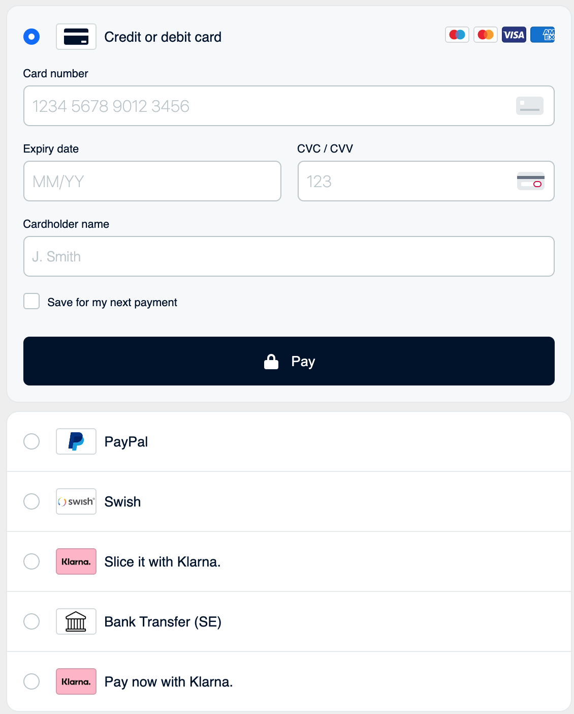
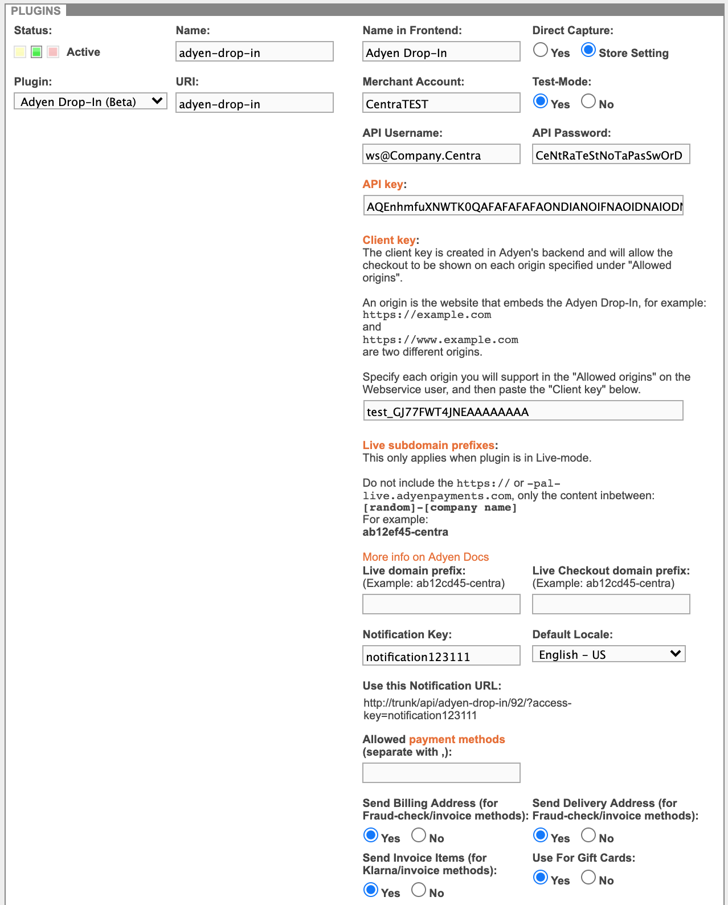
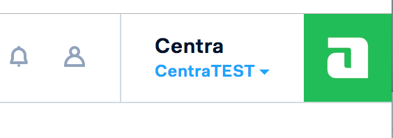
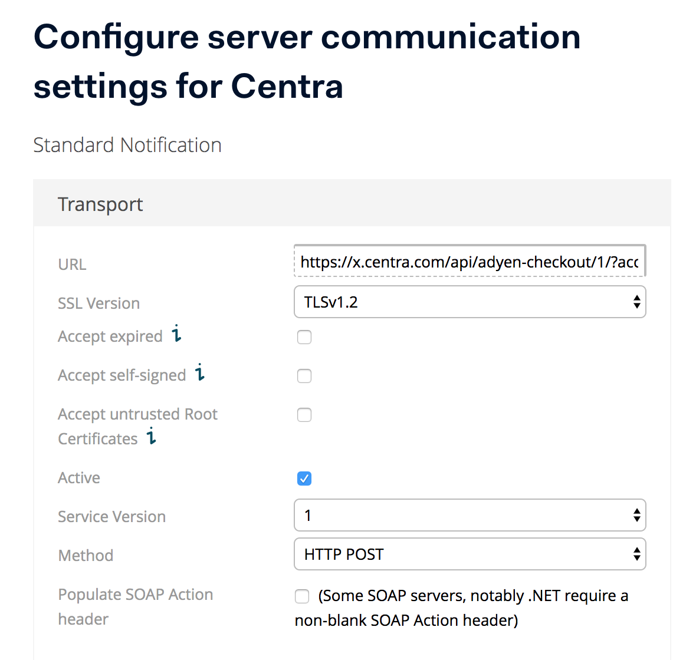
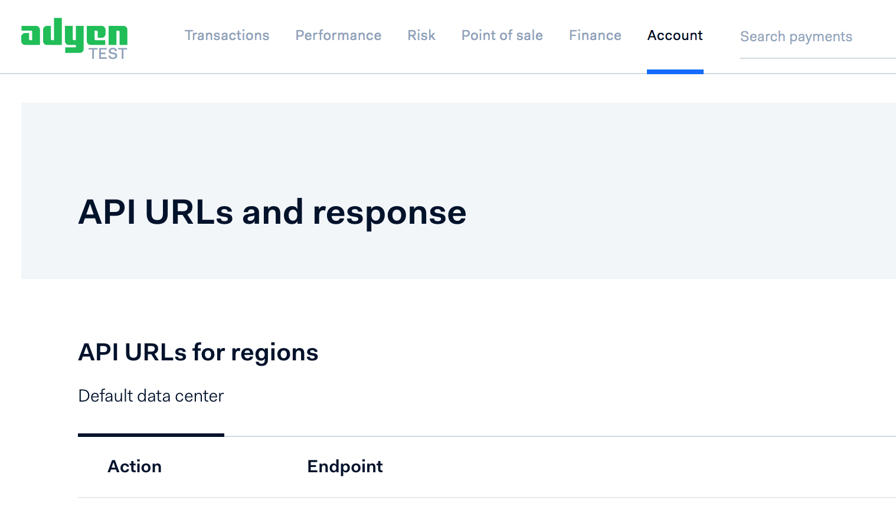
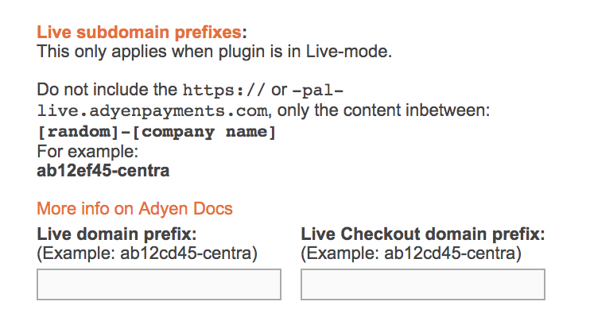
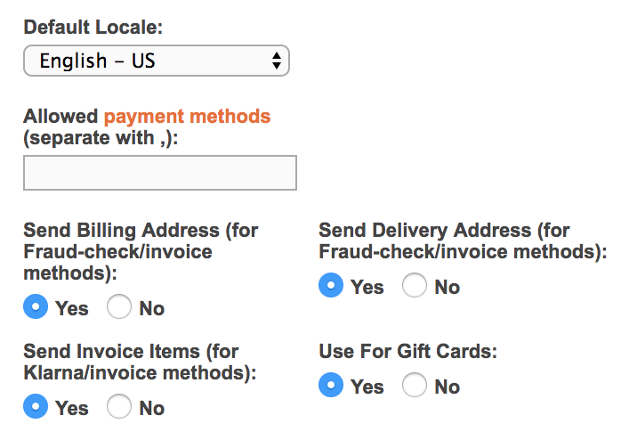

The Adyen Drop-In plugin is an inline part of the checkout containing the payment options the customer is allowed to use. 
It looks like this:



### Flow

There are two different flows supported for Adyen Drop-In. These two flows are different depending on how you want to fill in the address information. You are able to initiate the Adyen Drop-In without providing any address information directly on the checkout page when entering it. However, this requires you to make sure that when the customer has selected the payment method in Adyen Drop-In and the event to finalize the purchase is triggered, you need to make sure that the address is provided by the customer to proceed with the payment, else the payment will not be completed.

### Flow with initialization only

1. Customer adds products to the cart, customer has the right country and currency.
2. Customer goes to checkout. Centra API gets a `GET /selection`.
3. `adyen-drop-in` is found in the payment methods, the checkout page will initate the Adyen Drop-In directly, using `paymentInitiateOnly:true` to `POST /payment`.
4. Centra gives back HTML-snippet to initiate Adyen Drop-In.
5. Customer filles in the information, or selects what payment method they want to use.
6. Adyen Drop-In will send a `centra_checkout_payment_callback` event. The checkout page will see that `addressIncluded:false` and append the address information to the data and send everything to `POST /payment`. The value that makes sure the payment proceeds is the `paymentMethodSpecificFields`-property containing the encrypted payment information from Adyen.
7. The response from `POST /payment` will be returned, depending on the `action` in the response, the customer will be redirected to complete the payment, or JavaScript will be returned to send a `centra_checkout_payment_response` event back to Adyen Drop-In.
8. Adyen Drop-In will then redirect or post data to `paymentReturnPage` with the information about the payment.
9. Centra gets an API call to `POST /payment-result` from `paymentReturnPage` to finalize the payment or give back an error message.

### Flow with customer address filled in before initialization

If Adyen Drop-In is initiated after customer has filled in their address, the flow looks like this:

1. Customer fills in address information on the checkout page.
2. When the customer is done, they can select a payment option.
3. If Adyen Checkout is selected (Most likely by showing the Credit Card-logos/Swish/Klarna or similar as the payment option) a call should be made to Centra using `POST /payment` including the address information.
4. Centra will initiate Adyen Drop-In and give back a HTML-snippet together with an indication that you actually got `adyen-drop-in` in the response.
5. The website renders the HTML for Adyen Drop-In.
6. The customer fills in the information, or selects what payment method they want to use in Adyen Drop-In.
7. Adyen Drop-In will send a `centra_checkout_payment_callback` event. The checkout page will see that `addressIncluded:true`  and send everything to `POST /payment`.
7. The response from `POST /payment` will be returned, depending on the `action` in the response, the customer will be redirected to complete the payment, or JavaScript will be returned to send a `centra_checkout_payment_response` event back to Adyen Drop-In.
8. Adyen Drop-In will then redirect or post data to `paymentReturnPage` with the information about the payment.
9. Centra gets an API call to `POST /payment-result` from `paymentReturnPage` to finalize the payment or give back an error message.

### Server communication

The Adyen Drop-In needs its own Server Communication URL set up in Adyen. If you use multiple Merchant Accounts in Adyen, you need one per Merchant Account pointing to one of the Adyen Drop-In plugins inside Centra. If the Server Communication URL is not set up, all orders in Centra will never go out of "Waiting for Payment"-status and will be set as "Hold".

### Set up

[notice-box=info]
You need to contact Adyen Support at ``support@adyen.com`` to make sure they have activated Adyen Drop-In for your Merchant Account before you begin.
[/notice-box]

To validate that you are able to use the Adyen Drop-In, go to Accounts -> API Credentials, look at your user called `ws@Company.[YourCompanyAccount]` and make sure that these roles are enabled:


If they are not in the list, you need to contact Adyen to make them enable these roles for your Webservice user.

Then, create the plugin inside Centra. Select `Adyen Drop-In` and set your own name for it. Also define a `uri`. This is the keyword used in the API to select it. You can have multiple plugins pointing to Adyen Drop-In with the same `uri` if they are market/pricelist/country/language restricted for example, you can make sure you always use the same `uri` anyway.



The `Merchant Account` should be set for the Merchant Account you want to use for this plugin.

The `API Username` and `API Password` should be for the Web Service user called `ws@Company.[YourCompanyAccount]` at:

* Adyen Test: `https://ca-test.adyen.com/ca/ca/config/api_credentials.shtml`
* Adyen Live: `https://ca-live.adyen.com/ca/ca/config/api_credentials.shtml`

The `API key` previously used for CSE (Client Side Encryption) is now also used for Adyen Drop-In. [There's an article in Adyen Docs](https://docs.adyen.com/user-management/how-to-get-the-api-key/) on how to get it. 

[notice-box=info]
It will be the same user and API-key for all your merchant accounts if you have more than one.
[/notice-box]

#### Client key and allowed origins

The `Client key`-field contains the key generated on the Webservice user called `ws@Company.[YourCompanyAccount]`. This key is connected to the allowed origins specified on the same page. You will see the Client key section on the user settings page in Adyen:


When this Client key is added to the plugin, you can now edit the allowed origins where the checkout will be served from under "Allowed origins" in Adyen:


If your website is `example.com` and both `www.example.com` and `example.com` are valid domains for it, the origins you need to allow in Adyen's backend are:

`https://example.com`

and

`https://www.example.com`

There's more information about how to get your Client key in the [documentation about Client keys in Adyen Docs](https://docs.adyen.com/development-resources/client-side-authentication/migrate-from-origin-key-to-client-key).

#### Notification URL / Server communication

The `Notification URL` is used for the Server Communication from Adyen.

[notice-box=alert]
You should set a Server communication URL for each Merchant Account you have. Make sure you have selected a Merchant Account in Adyen before you add it on the "Server Communication"-page.
[/notice-box]



To add a new Service Communication URL in Adyen, go to `Developers` and then select `Webhooks`. Make sure that you have a Merchant Account selected (You should see "No merchant selected" in the top right of Adyen if you have not selected one) before you click `Add` on the "Standard Notification".

Enter the URL from the Adyen Drop-In-plugin from Centra. If you are creating a new plugin, please save the plugin once and open it again to see the Notification URL.

The Notification URL should look something like this:

`https://x.centra.com/api/adyen-drop-in/1/?access-key=AABBCCDD`

Make sure that:

1. It's using HTTPS
2. It's using your `*.centra.com`-subdomain (To make sure we can guarantee that it works).
3. It has a notification key that is complicated, use the auto generated one to make sure it's secure enough.

Now, copy the Notification URL into Adyen by selecting "Standard Notification":



Make sure that:

1. You set it to `Active`
2. You select `HTTP POST`

Under "Authentication" you should write anything you like in "User Name" and "Password". We're currently using the `Notification Key` as the shared secret. *NB: This might change in the future, we'll let you know.*

Now, press "Test Configuration" to verify we respond successfully. After that you can press "Save Configuration".

Repeat this step for the Merchant Accounts you use with Centra and make sure each "Service Communication URL" you use points to a plugin with the same Merchant Account set. Also make sure that your Server Communication URL points to an active or inactive Adyen Drop-In-plugin in Centra. If the plugin is disabled (red), the notification will not work.

### Live endpoint

Adyen Drop-In uses unique domains for talking with their API both for the Checkout, but also for capturing, cancelling and refunding the payments, the format will be `[random]-[company name]`. [More info in Adyen Docs](https://docs.adyen.com/development-resources/live-endpoints/)

The live endpoint prefix is something you find inside your [Adyen-live account here](https://ca-live.adyen.com/ca/ca/config/accountapi.shtml):



And it will look something like this:

`7ff08825ff786a90-CentraCompany`

You will define this for both Checkout and the standard payments endpoints in the plugin. These does only affect when Test Mode is off, in Test-Mode, the domains are the same for all customers.



[notice-box=alert]
Going live with Adyen Drop-In is not possible unless you have the Live endpoint prefix set up. Payments and Adyen Drop-In initialization will always fail.
[/notice-box]

### Other configurations

You can decide other settings on the plugin as well:



The `Default Locale` defines which language it should use. `Send Billing Address`, `Send Delivery Address` and `Send Invoice Items` defines if we should send the information to Adyen. This should help for fraud detection.

You can also define if Adyen Drop-In should be allowed for buying gift cards (if this is supported by the website). The gift cards are not being fulfilled by the warehouse, but directly issued and emailed to the customer if the payment goes through.

### Market/Pricelist/Country/Language restrictions

You can also restrict the Adyen Drop-In to only work for specified markets, pricelists, countries or languages. This is good if you want to use different Locales for the Adyen Drop-In. You can use the same `uri` for the Adyen Drop-In plugin using different restrictions.

### Configuration of Adyen Drop-In

As you see above, we use our own standard look of Adyen Drop-In. If you like to have other settings, you can set the `window.adyenDropInConfig`-property in your DOM to override our suggested settings. [Here you can find information about what options you can set for Adyen Drop-In for Cards](https://docs.adyen.com/payment-methods/cards/web-drop-in#drop-in-configuration).

### Capturing with Adyen Drop-In

Whenever you capture using Adyen Drop-In, the Payment Transaction-list in Centra will contain a `capture-request` instead. This is because Centra is actually waiting for the notification from Adyen to mark the order as captured successfully or not.
[notice-box=info]
Remember, if you have `Capture Delay` in Adyen set to `immediate`, capture will ALWAYS fail in Centra. Our recommendation is that Centra should capture the payment instead. Please change the Capture Delay setting in Adyen by going to `Account` then select "Configure->Settings" and make sure you select the Merchant Account. In the settings page you will see `Capture Delay`. Set it to `Manual` or `7 days` to make sure Centra will control the capture event.
[/notice-box]

## Implementation

Depending on when you want to show the Adyen Drop-In you can initiate it in two different ways using the parameter `paymentInitiateOnly:true`. When this property is provided to `POST /payment`, no address is required to be submitted, only the country and the payment method. This allows you to render the Adyen Drop-In before the customer has provided their shipping address. This can never complete the payment fully since an address is always required in the second step to complete the checkout.

When using the `paymentInitiateOnly:true`-mode, the payment method is selected in Adyen Drop-In and the event is being triggered from it (`centra_checkout_payment_callback`) the property `addressIncluded` will then be `false`, which means that the address needs to be provided from the checkout page when posting the `paymentMethodSpecificFields` to `POST /payment` to proceed with the payment.

If you want to initiate Adyen Drop-In before the customer has filled in their shipping information you can do the following:

`POST /payment` to Centra like this, the country is required since it will decide what payment options are available in combination with the currency of the selection:

```json
{
  "paymentReturnPage": "https://example.com/",
  "paymentMethod": "your-uri-of-payment-plugin",
  "paymentInitiateOnly": true,
  "termsAndConditions": true,
  "address": {"country": "SE"}
}
```
[notice-box=info]
``paymentInitiateOnly:true`` can only be sent to initiate the checkout, it can never finalize the selection.
[/notice-box]

After the customer has selected payment method and wants to proceed, the Adyen Drop-In will send a DOM-event called `centra_checkout_payment_callback` to the current site. This event contains the information needed to start the payment process in Centra. The event will have a property called `responseEventRequired:true`. This means that Adyen Drop-In wants a response to the event. The checkout page is supposed to send all data it gets in the event to Centra to `POST /payment` as an ajax-call. Depending on if `addressIncluded` is `true` or `false`, the checkout page might need to append the address to the data before sending it to `POST /payment`. `addressIncluded` will only be `false` if Adyen Drop-In was initiated without the customer address (using `paymentInitiateOnly:true` earlier).

The important part in the event data is the `paymentMethodSpecificFields` from Adyen Drop-In that contains the encrypted information for Centra to initiate the payment.

When the event `centra_checkout_payment_callback` is received by the checkout page, it should make a similar call like this:

`POST /payment`:

```json
{
  "paymentReturnPage": "https://example.com/",
  "paymentMethod": "your-uri-of-payment-plugin",
  "paymentMethodSpecificFields": {"taken from the event": "..."},
  "termsAndConditions": true,
  "address": {"taken from the event if addressIncluded:true else appended by checkout page": "..."},
  "shippingAddress": {"taken from the event if addressIncluded:true else appended by checkout page": "..."}
}
```

The response from this call will either result in an error, like this:

```json
{
    "errors": {
        "paymentMethod": "failed"
    },
    "messages": [
        "FRAUD"
    ]
}
```
This means the payment failed and the customer should be notified that the payment was not successful. The response could also contain a regular redirect action, like this:

```json
{
    "action": "redirect",
    "formType": "adyen-drop-in",
    "url": "https://bank.example.com"
}
```
When this happens, you should redirect the customer to the `url`.

The third and most common action is when the Adyen Drop-In needs to get a response back from the event it sent. It looks like this:

```json
{
    "action": "javascript",
    "formType": "adyen-drop-in",
    "formFields": {
        "action": {
            "paymentData": "Ab02b4",
            "paymentMethodType": "paypal",
            "sdkData": {
                "token": "EC-44V256178J461015N"
            },
            "type": "sdk"
        }
    },
    "code": "...document.dispatchEvent()..."
}
```

When you get `action=javascript` you can do two things, either you evaluate the `code`-property so the JavaScript gets triggered on the page, or, you send your own event, `centra_checkout_payment_response` containing the `formFields` from the response, like this:

```js
const response = await CentraAPI('POST', 'payment', paymentData);
if (response.action === 'javascript') {
  var updateEvent = new CustomEvent('centra_checkout_payment_response', {detail: response.formFields});
  document.dispatchEvent(updateEvent);
}
```

This will make the Adyen Drop-In handle the response and try to complete the payment process automatically, by either redirect the customer to the `paymentReturnPage` to complete the payment using the `POST /payment-result`-step, or by redirecting the customer to `paymentFailedPage` since the payment failed.

If no `paymentFailedPage` is provided, the customer will still be sent to the `paymentReturnPage`, but the `POST /payment-result` will give back a payment failure.

[notice-box=info]
If the customer tries to trick the checkout, by opening another tab to modify the cart, as soon as Centra gets the server notification call from Adyen, it will mark the order as "Payment mismatch" and set the order to "Hold". This is to prevent the order from ever being fulfilled if the payment amount does not match between the order and the payment from Adyen.
[/notice-box]


## Example implementation

We will now explain a regular checkout that includes Adyen Drop-In. In this case it's for CheckoutAPI, but the same thing applies to ShopAPI, only the way the API is called differs (since ShopAPI is strictly server-side).

When the customer goes to the checkout, you make a `GET /selection` call to fetch the current selection from Centra.

The Adyen Drop-In plugin will show up in the API as a payment method:

```json
"adyen-drop-in-shop": {
  "paymentMethod": "adyen-drop-in-shop",
  "name": "Adyen Drop-In",
  "paymentMethodType": "adyen_drop_in",
  "useForDigitalContent": true,
  "supportsInitiateOnly": true,
  "providesCustomerAddressAfterPayment": false,
  "addressRequiredFields": [
    "email",
    "firstName",
    "lastName",
    "address1",
    "zipCode",
    "city",
    "country"
  ],
  "hasTermsAndConditionsAgreement": false,
  "clientSide": {
    "externalScript": "https://checkoutshopper-test.adyen.com/checkoutshopper/sdk/3.11.4/adyen.js"
  }
},
```

The `clientSide->externalScript` is not needed, but if you want to load it before the Checkout, we still give you information about it here.

Adyen Drop-In supports `paymentInitiateOnly: true` when `POST /payment` is made. This means it can be initiated without providing address information. However, when the event is triggered after a payment method is selected, the event `centra_checkout_payment_callback` will include `addressIncluded:false`. This means the address needs to be appended manually when sending the `paymentMethodSpecificFields` to `POST /payment` to continue the payment process. If an address was provided in the first `POST /payment`, the `addressIncluded` will be `true` and `billingAddress` and `shippingAddress` will be provided in the event when a payment method is selected in Adyen Drop-In.

To initiate the Adyen Drop-In when it has been selected using `POST /payment`, the following response will be returned for you to initiate Adyen Drop-In:

```json
{
  "action": "form",
  "formType": "adyen-drop-in",
  "formFields": {
    "paymentMethodData": {
      "groups": [
        {
          "name": "Credit Card",
          "...": ""
        },
        {
          "name": "Pay now with Klarna.",
          "supportsRecurring": true,
          "type": "klarna_paynow"
        }
      ]
    },
    "returnUrl": "https://example.com/?pos=checkoutDone",
    "paymentMethod": "adyen-drop-in-shop",
    "locale": "en_US",
    "environment": "test",
    "clientKey": "test_ABCDEFG",
    "addressData": {
      "if address was provided, else null": "..."
    }
  },
  "formHtml": "<div id="adyen-drop-in-container-..."
}
```

You can decide here if you want either to initiate the Adyen Drop-In by listening on the `formType`-field saying `adyen-drop-in` and initiate your own Adyen Drop-In using the `clientSide->externalScript` defined earlier, or render the `formHtml` directly.

The `formHTML` looks similar to this:

```html
<div id="adyen-drop-in-container-RANDOM" class="adyen-drop-in-container"></div>
<script id="adyen-session-RANDOM"
  data-return-url="RETURNURL" data-payment-method="PAYMENTMETHOD"
  type="application/json">PAYMENTDATA</script>
<script id="adyen-request-data-RANDOM" type="application/json">ADDRESSDATA</script>
<script>
window.AdyenDropIn = null;
function loadAdyenDropIn() {
    var oldScript = document.getElementById('adyen-drop-in-external-script')
    if(oldScript) {
        if(AdyenDropIn) {
            // already loaded, run init
            adyenDropInInit();
        }
        return;
    }
    var newScript = document.createElement('script');
    newScript.id = 'adyen-drop-in-external-script';
    newScript.async = true;
    newScript.src = 'https://...';
    newScript.onload = adyenDropInInit;
    
    var newStyle = document.createElement('link');
    newStyle.rel = 'stylesheet';
    newStyle.href = 'https://...';
    
    if (document.children) {
        document.children[0].appendChild(newStyle);
        document.children[0].appendChild(newScript);
    } else {
        document.head.appendChild(newStyle);
        document.body.parentNode.appendChild(newScript);
    }
}
function adyenDropInInit() {
    var randomId = 'RANDOM';
    var scriptObject = document.getElementById('adyen-session-' + randomId);
    var paymentMethodsResponse = JSON.parse(scriptObject.textContent);
    var returnUrl = scriptObject.dataset.returnUrl;
    var paymentMethod = scriptObject.dataset.paymentMethod;
    
    var addressObject = document.getElementById('adyen-request-data-' + randomId);
    var addressDataObject = JSON.parse(addressObject.textContent);
    var configurationObject = {
      locale: "en-US",
      environment: "test",
      clientKey: "AABBCC",
      paymentMethodsResponse: paymentMethodsResponse
    };
    
    var checkout = new AdyenCheckout(configurationObject);
    
    var updatePaymentRequest = function(event, dropin, origdata) {
        if (origdata.detail.action) {
            dropin.handleAction(origdata.detail.action)        
        }
    };
    
    var paymentSubmit = function(state, component) {
      var f = document.createElement('form');
      f.method = 'post'; // required to be supported since adyen might send POST from 3DS
      f.action = returnUrl;
      var items = flattenForPost(state.data, '');
      var itemKeys = Object.keys(items);
      for (var i = 0; i < itemKeys.length; i++) {
          var inp = document.createElement('input');
          inp.type = 'hidden';
          inp.name = itemKeys[i];
          inp.value = items[itemKeys[i]];
          f.appendChild(inp);
      }
      f.style = 'position:absolute;left:-100px;top:-100px;';
      document.body.appendChild(f);
      f.submit();
    }
    
    var paymentResponse = function(state, component) {
        
        var eventObject = {
           paymentMethod: paymentMethod,
           paymentMethodSpecificFields: state.data,
           responseEventRequired: true,
           addressIncluded: addressDataObject ? true : false,
        }
        if (addressDataObject) {
          Object.assign(eventObject, addressDataObject);            
        }
        document.addEventListener(
          'centra_checkout_payment_response',
          updatePaymentRequest.bind(null, event, window.AdyenDropIn),
          { once: true }
        );
        paymentCompleteEvent = new CustomEvent("centra_checkout_payment_callback", {detail:eventObject});
        document.dispatchEvent(paymentCompleteEvent);
    }
        
    window.AdyenDropIn = checkout.create('dropin', {
      paymentMethodsConfiguration: window.adyenDropInConfig || {
        card: {
          hasHolderName: true,
          holderNameRequired: true,
          enableStoreDetails: true,
          name: 'Credit or debit card'
        }
      },
      onSubmit: paymentResponse,
      onAdditionalDetails: paymentSubmit
    })
    .mount('#adyen-drop-in-container-RANDOM');
}
loadAdyenDropIn();
</script>
```

The form will:

1. Load the same script from Adyen specified in `clientSide->externalScript`.
2. When the script has loaded, launch the Adyen Drop-In using payment method settings from `window.adyenDropInConfig` or the predefined JSON.
3. When the payment method is selected by the customer, an event will trigger on the page, called `centra_checkout_payment_callback`. When this even is triggered you should post the values back to Centra's API to `POST /payment`. Depending on if `addressIncluded` is `true` or `false`, the customer's address might need to be included in this API-call. 
4. Centra can respond to the request in three different ways. Using `action=javascript`, the JavaScript in the `code`-field should be evaluated (or sent back using the `centra_checkout_payment_response` event). If `action=redirect`, the user should be redirected to the `url`-property. The customer will then either complete payment process, be presented with additional data to fill in (like 3D-secure) or redirected to an additional payment step. It can also respond with `errors`, just like a regular [`PaymentActionResponse`, explained in the Swagger UI](https://docs.centra.com/swagger-ui/?api=CheckoutAPI#/4.%20selection%20handling%2C%20checkout%20flow/post_payment) and they should also be supported and present to the customer that the payment failed.
5. After payment has been completed, the customer is then returned to `paymentReturnPage` with the encrypted blob payload.
6. The `paymentReturnPage` should always collect all URL-parameters from both the query string in the URL and the POST-data and send it to Centra. This is the way to validate if the payment went through successfully or not.

You need to make sure you insert the HTML into your DOM, and also make sure you evaluate the javascript from the response. One solution to do this in React is to inject the HTML into the DOM, then run the following code on it:

Insert HTML into DOM:

```js
const dropInContainer = document.getElementById('adyenDropInContainer'); // Reference to element already on page
dropInContainer.innerHTML = data.formHtml;
evaluate($dropInContainer);
```

Execute Javascript:

```js
export const evaluate = (subtree: any, context: {} = window) => {
  function getSnippetType(script: any) {
    return script.type || '';
  }
  function getRawSnippet(script: any) {
    return script.text || script.textContent || script.innerHTML || '';
  }

  if (subtree) {
    try {
      const scripts = subtree.getElementsByTagName('script');
      const scriptsAsArray = Array.from(scripts).filter(script => getSnippetType(script) !== 'application/json');

      scriptsAsArray.forEach((script) => {
        const unescaped = getRawSnippet(script).replace(/\\/gi, '');
        eval.call(context, unescaped);
      });
    } catch (error) {
      // tslint:disable-next-line:no-console
      console.error('Catched error in evaluate function:', error);
    }
  }
};
```

This will make sure that:

1. You do not evaluate `type=application/json` blobs from Centra.
2. The proper snippet will run after the DOM has changed.

### The DOM-events in Adyen Drop-In

Since Adyen Drop-In does not know how you make requests to Centra's API, you need to listen to events from Adyen Drop-In and trigger API-calls to Centra. Adyen Drop-In can currently trigger one event, completing the payment, `centra_checkout_payment_callback`. When this event is received, you need to make an API-call to Centra to `POST /payment`. This event will also contain a property called `responseEventRequired` which will be `true`. This means that you need to respond to the event with a new event, `centra_checkout_payment_response`, using the response from the `POST /payment` for the payment flow to go through. Below you will see an example flow of how to implement this.

For completing the payment, you post the data from the event just like a regular `POST /payment` to finalize the order by using the parameters provided. This data can include the `billingAddress` and `shippingAddress` if `addressIncluded:true`. `addressIncluded` will only be `false` if `paymentInitiateOnly` was provided when initiating Adyen Drop-In.

The most important field is the `paymentMethodSpecificFields` that contain the data to finalize the order. The event will as mentioned contain `responseEventRequired:true` which means you need to respond to the event after you get the response from Centra. 

<div class="tableWrapper" markdown='1'>
| Event to handle | Parameters | Response event needed |
| --------------- | ---------- | --------------------- |
| `centra_checkout_payment_callback` with `addressIncluded:true` | `responseEventRequired:true` `addressIncluded:true` `paymentMethod` `billingAddress` `shippingAddress` `paymentMethodSpecificFields` | Make a regular `POST /payment`, similar to when checkout is submitted, but with the params provided from the event. Since `responseEventRequired:true` you need to respond with a `centra_checkout_payment_response`. |
| `centra_checkout_payment_callback` with `addressIncluded:false` | `responseEventRequired:true` `addressIncluded:true` `paymentMethod` `billingAddress` `shippingAddress` `paymentMethodSpecificFields` | Make a regular `POST /payment`, similar to when checkout is submitted, append `address` and `billingAddress` to the call combined with the params provided from the event. Since `responseEventRequired:true` you need to respond with a `centra_checkout_payment_response`. |
</div>

<!--
```eval_rst
.. list-table::
   :widths: auto
   :class: small-table api-command-list
   :header-rows: 1

   * - Event to handle
     - Parameters
     - Response event needed
   * - ``centra_checkout_payment_callback`` with ``addressIncluded:true``
     - | ``responseEventRequired:true``
       | ``addressIncluded:true``
       | ``paymentMethod``
       | ``billingAddress``
       | ``shippingAddress``
       | ``paymentMethodSpecificFields``
     - | Make a regular ``POST /payment``,
       | similar to when checkout is submitted,
       | but with the params provided from the event.
       | Since ``responseEventRequired:true`` you need to respond
       | with a ``centra_checkout_payment_response``.
   * - ``centra_checkout_payment_callback`` with ``addressIncluded:false``
     - | ``responseEventRequired:true``
       | ``addressIncluded:false``
       | ``paymentMethod``
       | ``billingAddress``
       | ``shippingAddress``
       | ``paymentMethodSpecificFields``
     - | Make a regular ``POST /payment``,
       | similar to when checkout is submitted,
       | append ``address`` and ``billingAddress`` to the call
       | combined with the params provided from the event.
       | Since ``responseEventRequired:true`` you need to respond
       | with a ``centra_checkout_payment_response``.
```
-->

If the response to `POST /payment` has `action=javascript`, this response will also have a `code`-property that will issue the `centra_checkout_payment_response` automatically if you evaluate it. However, you can also run the event-response yourself like this:

```js
document.addEventListener('centra_checkout_payment_callback', function(origdata) {
  var postData = origdata.detail;
  var responseEventRequired = postData.responseEventRequired;
  var addressIncluded = postData.addressIncluded;
  
  const response = await CentraAPI('POST', 'payment', {
    payment: postData.paymentMethod,
    address: addressIncluded ? postData.shippingAddress : shippingAddressFromCheckout(),
    billingAddress: addressIncluded ? postData.billingAddress : billingAddressFromCheckout(),
    paymentMethodSpecificFields: postData.paymentMethodSpecificFields
  });
  if (responseEventRequired) {
    if(data.action === 'redirect') {
      location.href = data.url;
      return;
    }
    if (data.errors) {
      // Payment failed for some reason, show error
      ShowPaymentFailedError(data.errors);
      return;
    }
    // action is javascript, send back the formFields
    sendCentraEvent("centra_checkout_payment_response", response.formFields);
  }
});
```

This will make sure the Adyen Drop-In gets the event data from Centra to finalize the payment.

### Payment finalization fields

Above we registered the following handler, similar like this:

```js
document.addEventListener('centra_checkout_payment_callback', this.paymentSelected);
```

When a payment method in Adyen Drop-In is selected this event will trigger.

The following data is returned in this event:

| Field | Type | Comment |
| ----- | ---- | ------- |
| `responseEventRequired` | boolean | Always `true` for Adyen Drop-In. This means the payment callback needs a response event to complete, with the following name: `centra_checkout_payment_response` |
| `addressIncluded` | boolean | Will be `true` when `billingAddress` and `shippingAddress` is included in the event. This one will be `false` if Adyen Drop-In was not initiated with an address included, using `paymentInitiateOnly:true`. |
| `paymentMethodSpecificFields` | object | This data should be sent to the `POST /payment` call in Centra for the payment to be validated. |
| `paymentMethod` | string | The selected payment method used. |
| `billingAddress` | object | Data containing the address for billing. |
| `billingAddress.firstName` | string | |
| `billingAddress.lastName` | string | |
| `billingAddress.address1` | string | |
| `billingAddress.address2` | string | |
| `billingAddress.zipCode` | string | |
| `billingAddress.state` | string | Optional, might be empty for countries not supporting states. |
| `billingAddress.city` | string | |
| `billingAddress.country` | string | Country code |
| `billingAddress.phoneNumber` | string | |
| `billingAddress.email` | string | |
| `shippingAddress` | object | Data containing the address for shipping. |
| `shippingAddress.firstName` | string | |
| `shippingAddress.lastName` | string | |
| `shippingAddress.address1` | string | |
| `shippingAddress.address2` | string | |
| `shippingAddress.zipCode` | string | |
| `shippingAddress.state` | string | Optional, might be empty for countries not supporting states. |
| `shippingAddress.city` | string | |
| `shippingAddress.country` | string | Country code |
| `shippingAddress.phoneNumber` | string | |
| `shippingAddress.email` | string | |

<!--
```eval_rst
.. list-table::
   :widths: auto
   :class: small-table
   :header-rows: 1

   * - Field
     - Type
     - Comment
   * - ``responseEventRequired``
     - boolean
     - | Always ``true`` for Adyen Drop-In.
       | This means the payment callback needs a response event to complete, with the following name:
       | ``centra_checkout_payment_response``
   * - ``addressIncluded``
     - boolean
     - | Will be ``true`` when ``billingAddress`` and ``shippingAddress`` is included in the event. This one will be ``false`` if Adyen Drop-In was not initiated with an address included, using ``paymentInitiateOnly:true``.
   * - ``paymentMethodSpecificFields``
     - object
     - | This data should be sent to the ``POST /payment`` call
       | in Centra for the payment to be validated.
   * - ``paymentMethod``
     - string
     - The selected payment method used.
   * - ``billingAddress``
     - object
     - Data containing the address for billing.
   * - ``billingAddress.firstName``
     - string
     -
   * - ``billingAddress.lastName``
     - string
     -
   * - ``billingAddress.address1``
     - string
     -
   * - ``billingAddress.address2``
     - string
     -
   * - ``billingAddress.zipCode``
     - string
     -
   * - ``billingAddress.state``
     - string
     - Optional, might be empty for countries not supporting states.
   * - ``billingAddress.city``
     - string
     -
   * - ``billingAddress.country``
     - string
     - Country code
   * - ``billingAddress.phoneNumber``
     - string
     -
   * - ``billingAddress.email``
     - string
     -
   * - ``shippingAddress``
     - object
     - Data containing the address for shipping.
   * - ``shippingAddress.firstName``
     - string
     -
   * - ``shippingAddress.lastName``
     - string
     -
   * - ``shippingAddress.address1``
     - string
     -
   * - ``shippingAddress.address2``
     - string
     -
   * - ``shippingAddress.zipCode``
     - string
     -
   * - ``shippingAddress.state``
     - string
     - Optional, might be empty for countries not supporting states.
   * - ``shippingAddress.city``
     - string
     -
   * - ``shippingAddress.country``
     - string
     - Country code
   * - ``shippingAddress.phoneNumber``
     - string
     -
   * - ``shippingAddress.email``
     - string
     -
```
-->

We would take the event data, and create a `checkoutRequest` based on the data provided. This data would then be sent to the `POST /payment` in the Centra API.

```js
  paymentSelected = (event: any) => {
    const { checkoutRequest: checkout } = this.props;
    const { paymentMethodSpecificFields, paymentMethod } = event.detail;
    const { billingAddress: billingAddressData, shippingAddress: shippingAddressData } = event.detail;
    const billingAddress: IAddress = Address.create(billingAddressData);
    const shippingAddress: IAddress = Address.create(shippingAddressData);
    checkout({
      paymentMethodSpecificFields,
      paymentMethod: paymentMethod,
      billingAddress: billingAddress,
      shippingAddress: shippingAddress,
    });
  }
```

Since the `responseEventRequired` is `true`, Adyen Drop-In needs a response to this event to be able to finalize the payment process. When sending the `POST /payment` using the `paymentMethodSpecificFields` provided by the event from Adyen Drop-In, the following response details will be returned:

| Field | Type | Comment |
| ----- | ---- | ------- | 
| `action` | string | `javascript`, `redirect` or `failed`. If `javascript`, evaluate the data inside `code` or send back `formFields` to the event called `centra_checkout_payment_response` |
| `code` | string | Optional. Only if `action=javascript`. |
| `url` | string | Optional. Only if `action=redirect`. |
| `formFields` | object | Data containing the payment finalization. Can be sent back in an event called `centra_checkout_payment_response` |
| `errors` | object | List of errors if payment failed. |

<!--
```eval_rst
.. list-table::
   :widths: auto
   :class: small-table
   :header-rows: 1

   * - Field
     - Type
     - Comment
   * - ``action``
     - string
     - | ``javascript``, ``redirect``, ``failed`` or direct ``success``.
       | If ``javascript``, evaluate the data inside ``code``
       | or send back ``formFields`` as an event called
       | ``centra_checkout_payment_response``
   * - ``code``
     - string
     - | Optional. Only if ``action=javascript``.
   * - ``url``
     - string
     - | Optional. Only if ``action=redirect``.
   * - ``formFields``
     - object
     - | Data containing the payment finalization.
       | Can be sent back in an event called
       | ``centra_checkout_payment_response``
   * - ``errors``
     - object
     - List of errors if payment failed.
```
-->

The [`PaymentActionResponse`, explained in the Swagger UI](https://docs.centra.com/swagger-ui/?api=CheckoutAPI#/4.%20selection%20handling%2C%20checkout%20flow/post_payment) and in [Payment Method flows](https://docs.centra.com/guides/shop-api/payment-method-flows) does not differ specifically for Adyen Drop-In, the important part is to support ``action=javascript`` to provide info to the already embedded Adyen Drop-In form.

Direct ``success`` can be seen for free orders (including shipping cost), or if your customer paid with a credit card without 3DS verification. In this case, you can display the receipt page immediately.

### Parameters sent to paymentReturnPage

[notice-box=alert]
The `paymentReturnPage` should always collect all URL-parameters from both the query string in the URL and the POST-data and send it to Centra. This is the way to validate if the payment went through successfully or not. Some payment methods used through Adyen Drop-In will use POST-data instead of sending back the parameters as query string parameters.

Also, if you're running serverless, you can not use an endpoint to convert the POST-data into query-parameters directly, since the payload from Adyen can be really large (since it grows depending on how many items the selection contains for example). If you need to use something else than POST-data, you can have an endpoint receiving the POST-data and converts it to fragment-data, like this: `https://example.com/thank-you#centraPaymentMethod=x&payload=xyz`, that way you will not hit any issues with too long URLs. You then need to parse the fragment part just like query parameters to send the data to the `POST /payment-result`-endpoint.

Another solution would be to have an endpoint that injects the data into the DOM as JSON (using the example code below) to then send the data to Centra.
[/notice-box]

To make sure you support both POST/GET requests and outputs the data into the DOM properly (for you javascript to pick up the parameters and send them to Centra's `POST /payment-result`, here's example code for Node.js to collect POST/GET-parameters into a variable in the DOM. The code below also supports associative arrays in POST (like `details[paymentAction]=xxx`) since Adyen does send this kind of data.

```js
  function toJSON(formData) {
    split = /[\[\]]+/;
    fields = Array.from(formData.keys());
    values = Array.from(formData.values());
    const hierarchyFields = fields.map(field => field.split(split).filter(floor => floor !== ""))
    const data = values.reduce( (data,value,index) => {
        let swap = data
        let h = hierarchyFields[index]
        h.forEach((floor,index,fieldsHierarchy) => {
            if(!fieldsHierarchy[index + 1]){
                swap[floor.replace("[]","")] = value
                return
            }
            if(!swap[floor]){
                swap[floor] = {};
                if(!isNaN(parseInt(fieldsHierarchy[index + 1]))){
                    swap[floor] = [];
                }
            }
            swap = swap[floor];
        })
        return data
    },{})
    return data;
  }
  async function convertPostAndGetToJSON(request) {
    let postData = {}
    try {
      postData = toJSON(await request.formData());
    } catch(e) { }
    const getData = toJSON(await new URL(request.url).searchParams);
    Object.assign(postData, getData)
    return JSON.stringify(postData).replace(/\//g, '\\\/')
  }
```

We can then use this with the `request`-object:

```js
let payload = await convertPostAndGetToJSON(request);
```

And then insert in the DOM like this for the javascript to use it to finalize the payment:

```html
<script>window.PaymentPayload = {{ payload }}</script>
```

[notice-box=alert]
If you are using the solution above to fill the DOM directly with the POST-data, you need to make sure that if you use cookie-storage for the current token of the user, that the cookie is set with `SameSite=None`. [More information from Adyen](https://www.adyen.help/hc/en-us/articles/360013000160-How-does-the-Chrome-SameSite-Cookie-policy-affect-my-integration). The reason for this is that when the POST-data comes back from the 3ds-payment flow, the cookies will not be present if they're not explicitly set as `SameSite=None`. We recommend the conversion to fragment data, as that doesn't require you to change the SameSite-option of the current token.
[/notice-box]

### Test payment data endpoint

Here's a test endpoint that behaves like the `paymentResultPage` should do in terms of collecting query/POST parameters to properly support all payment methods:

```
$ curl "https://payment-result-example.devteam.workers.dev/?test=1&test2=1"
<script>window.PaymentPayload = {"test":"1","test2":"1"}</script>
```

```
$ curl -X POST -d "test[ok]=1&test[ok2]=1" "https://payment-result-example.devteam.workers.dev/?test=1&test2=1"
<script>window.PaymentPayload = {"test":{"ok":"1","ok2":"1"},"test2":"1"}</script>
```

### Testing

To test the flow, you first need to make sure the `Test-Mode` is enabled and that the credentials inside the Centra plugin are taken from `ca-test.adyen.com` instead of `ca-live.adyen.com`.

[notice-box=alert]
You will need to disable test-mode for the plugin in Centra when you run it in production.
[/notice-box]

You can then use the [test-cards provided by Adyen](https://docs.adyen.com/developers/development-resources/test-cards/test-card-numbers) to place test orders. Please also verify by also trying [Test cards for 3DS2 authentication](https://docs.adyen.com/development-resources/test-cards/test-card-numbers#test-3d-secure-2-authentication)
